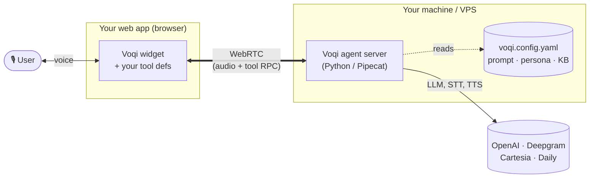
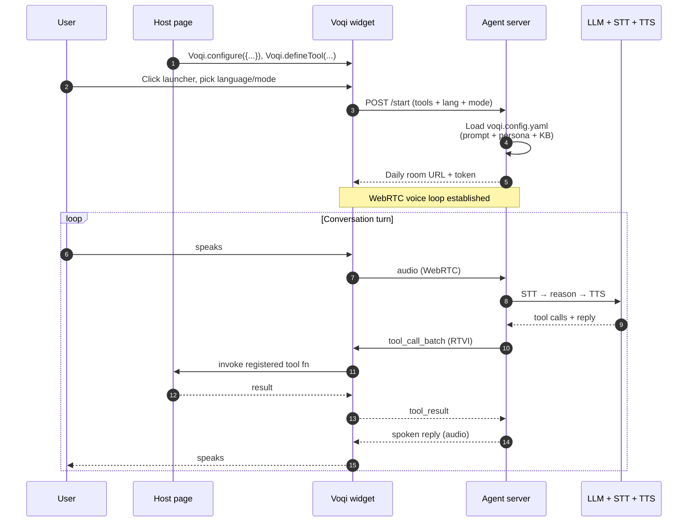

# Voqi

**Make any web app voice-controllable in 37 languages in 5 minutes.**

<video src="https://github.com/user-attachments/assets/67576816-606f-4db0-a749-219ca78e482a" controls poster="docs/assets/launch.jpg" width="100%"></video>

Voqi is an open-source voice control layer for web apps. Drop in a
widget, define a few tools, and your users can operate your software
by talking to it — creating records, navigating screens, running queries, all hands-free.



No backend. No SaaS sign-up. You run the agent server yourself, define
tools in your app code, and the voice loop runs locally. Bring your
own API keys for OpenAI, Daily, Deepgram, Cartesia.

> **Looking for production scale?** The managed version is
> [Aelios AI](https://aeliosai.com) — autoscaling, multi-tenant
> agents, hosted control plane, continuous-learning loops, and a
> separate **video demo agent** that learns your software and
> streams hands-free product demos 24/7. The OSS Voqi widget is the
> same code path; the managed platform adds the surfaces around it.

---

## Table of contents

- [Quick start](#quick-start) — get it running in 5 minutes
- [How it works](#how-it-works) — a session, end to end
- [Two registration patterns](#two-registration-patterns) — how the
  host page wires everything up
- [Two modes — action and guide](#two-modes--action-and-guide) — the
  agent operates your app, OR it narrates it
- [Languages](#languages) — the 37 the widget ships with
- [What you need](#what-you-need) — bring-your-own-key providers
- [Repo layout](#repo-layout)
- [Deep documentation](#deep-documentation) — the rest of the system,
  one doc per concern
- [Contributing](#contributing)
- [License](#license)

---

## Quick start

You need three things running:

1. **Agent server** (Python, this repo)
2. **Widget bundle** (TypeScript, this repo — build once)
3. **Your web app** (where the widget gets embedded)

```bash
# Clone
git clone https://github.com/Aelios-AI/voqi
cd voqi

# 1. Agent server
cd packages/agent-server
cp .env.example .env       # paste in OPENAI_API_KEY, DAILY_API_KEY, etc.
uv sync
uv run python server.py    # serves :3002

# 2. Widget bundle (in another terminal)
cd packages/widget
npm install
npm run build              # produces dist/voqi-widget.js

# 3. Try the example app
cd ../../examples/tracker
npm install && npm run copy-widget
npm run dev                # → http://localhost:5180
```

Open the example, click the launcher, and talk to your tasks app. Try
*"create a task to ship the release notes by Friday"* or
*"list tasks assigned to Alice"*.

Full step-by-step with troubleshooting in
[`docs/quickstart.md`](docs/quickstart.md).

---

## How it works



A session has three layers:

1. **Widget** runs in your visitor's browser. It captures audio,
   renders the chrome, holds the tool registry, and talks to the
   agent server over WebRTC + RTVI.
2. **Agent server** runs on your machine (or VPS). It hosts a Pipecat
   pipeline — STT → LLM → TTS → audio out — plus the
   `InAppAgentProcessor` state machine that schedules tool calls,
   manages demonstrations, requests screenshots, runs idle timers,
   and applies schema-gated structured output.
3. **Your web app** (the host page) registers tools and calls
   `Voqi.configure(...)` to point at the agent server and tweak the
   pill's position + theme colors.

Tool calls flow over the RTVI data channel; audio flows over WebRTC.
Everything is one-session-per-process — no shared state.

For the full architecture (priority queue, five wake modes,
demonstrations, screenshot service, tool dispatcher, watchdogs, the
RTVI custom-message protocol), read
[`docs/architecture.md`](docs/architecture.md).

---

## Two registration patterns

The host page interacts with the widget through two patterns. They
serve different concerns and can be called in any order.

### Pattern 1 — `Voqi.configure({...})`: agent URL + widget look

Tells the widget where the agent server is and how it should look.
The full surface is small — see [`docs/configuration.md`](docs/configuration.md):

```js
Voqi.configure({
    agentUrl: "http://localhost:3002/start",
    branding: {
        position: "bottom-right",      // or "bottom-left"
        themeColors: {                 // optional palette override
            primary: "#F4F5F7",
            bg: "#0A0A0A",
            text: "#F4F5F7",
            muted: "#A0A0A0",
            onPrimary: "#0A0A0A",
        },
    },
});
```

### Pattern 2 — `Voqi.defineTool({...})`: callable functions

Each tool the agent can invoke during voice turns. Tools accumulate
in an in-memory registry; at session start, the registry is forwarded
to the agent server as the session's tool set.

```js
Voqi.defineTool({
    name: "create_contact",
    description: "Add a new contact. Use when the user says 'add' or names a new person.",
    parameters: {
        type: "object",
        properties: {
            name: { type: "string" },
            email: { type: "string" },
        },
        required: ["name"],
    },
    execute: async ({ name, email }) => myApi.createContact({ name, email }),
    requiresConfirmation: false,    // set true for destructive ops
});
```

### The `VoqiReady` queue — order-independent setup

Both patterns work through a callback queue so they're safe to call
before the widget bundle has finished loading:

```html
<script src="/voqi-widget.js" data-agent-url="http://localhost:3002/start"></script>
<script>
  window.VoqiReady = window.VoqiReady || [];
  window.VoqiReady.push((Voqi) => {
    Voqi.configure({ ... });
    Voqi.defineTool({ ... });
    Voqi.defineTool({ ... });
  });
</script>
```

Then on the server side — tell the agent who it is, what your
software is, and what it should know about it — in
`packages/agent-server/voqi.config.yaml`. Both the agent's persona
**and** the host software's knowledge base live here, because both
get baked into the system prompt the LLM sees every turn:

```yaml
agent:                          # who the agent is
  name: "Acme Assistant"
  personality: "Friendly and precise."

software:                       # the app the widget is embedded in
  name: "Acme CRM"
  tldr: "A simple CRM for small teams."
  docs_file: "./knowledge.md"   # KB the agent draws on for every reply

additional_instructions: |      # any extra business rules / style notes
  You operate Acme CRM on behalf of the user via voice. Be concise.
```

Restart the agent server and refresh your app — voice control is live.

Full tool-writing guide in [`docs/tools.md`](docs/tools.md).
Full widget config schema in
[`docs/configuration.md`](docs/configuration.md).

---

## Two modes — action and guide

Voqi sessions run in one of two modes. The visitor picks at session
start; the choice is frozen for the session.

| | `action` (default) | `guide` |
|---|---|---|
| Calls your tools | yes | **no** |
| Sees the screen | only when the agent decides | every turn |
| Points to UI | no | yes (ghost cursor) |
| Best for | *operating* your app | *narrating* your app |

**Action mode** is the agent operating your software on the
visitor's behalf — voice-driven CRUD, dictation-with-effects,
hands-free workflows. The agent only sees the screen when it
explicitly requests a screenshot.

**Guide mode** is read-only narration with on-screen pointing —
onboarding, accessibility, sales demos. The agent gets a screenshot
every turn and can drop a ghost cursor (an arrow + fixed "Agent"
tag) onto any element on the page; what to do there is conveyed by
the spoken reply itself. It cannot call tools; the schema literally
drops the `tool_invocations` field.

Both modes run through the same `InAppAgentProcessor`, but each has
its **own** Jinja system-prompt template
(`IN_APP_AGENT_TURN_TEMPLATE` for action, `IN_APP_AGENT_GUIDE_TURN_TEMPLATE`
for guide) — guide mode has no tools, no demonstrations, no batches,
so a shared template would bury the relevant instructions under
sections the LLM has to skip every turn. Schema gating layers on top:
guide mode's schema literally drops the `tool_invocations` field.
Full breakdown — when to use each, the schema differences, the
two-trigger rule, the confirmation flow — in
[`docs/modes.md`](docs/modes.md).

---

## Languages

The widget ships a hardcoded **37-language picker** that visitors
choose from at session start. The chosen language code is sent in
the `/start` body; the agent server runs Deepgram Nova-3 STT for
all 37 (configured per-session via the ``language`` enum) and
Cartesia handles TTS.

🇸🇦 Arabic · 🇧🇬 Bulgarian · 🇨🇳 Chinese · 🇭🇷 Croatian ·
🇨🇿 Czech · 🇩🇰 Danish · 🇳🇱 Dutch · 🇺🇸 English · 🇫🇮 Finnish ·
🇫🇷 French · 🇩🇪 German · 🇬🇷 Greek · 🇮🇳 Gujarati · 🇮🇱 Hebrew ·
🇮🇳 Hindi · 🇭🇺 Hungarian · 🇮🇩 Indonesian · 🇮🇹 Italian ·
🇯🇵 Japanese · 🇮🇳 Kannada · 🇰🇷 Korean · 🇲🇾 Malay ·
🇮🇳 Marathi · 🇳🇴 Norwegian · 🇵🇱 Polish · 🇵🇹 Portuguese ·
🇷🇴 Romanian · 🇷🇺 Russian · 🇸🇰 Slovak · 🇪🇸 Spanish ·
🇸🇪 Swedish · 🇵🇭 Tagalog · 🇮🇳 Tamil · 🇮🇳 Telugu · 🇹🇭 Thai ·
🇹🇷 Turkish · 🇻🇳 Vietnamese

All 37 ship with native Cartesia voices out of the box. **All bundled
voices are female** — if you set `agent.name` in `voqi.config.yaml`,
pick a feminine name so the persona name and the spoken voice match.
Operators who want a different voice (different gender, different
accent, custom clone) should override per-agent via `voice_languages`
or edit `CARTESIA_TTS_VOICES` in
[`adapters/languages.py`](packages/agent-server/adapters/languages.py).

The picker list is fixed in
[`Widget.tsx`](packages/widget/src/Widget.tsx) and not host-
configurable.

---

## What you need

Bring-your-own-key. None of these are baked in:

| Provider | What for | Required |
|---|---|---|
| [OpenAI](https://platform.openai.com/) | Main LLM | yes |
| [Daily](https://daily.co) | WebRTC transport | yes (free tier covers dev) |
| [Deepgram](https://deepgram.com) | Speech-to-text — Nova-3 covers all 37 languages | yes |
| [Cartesia](https://cartesia.ai) | Agent's voice (text-to-speech) | yes |
| [Google AI Studio](https://aistudio.google.com) | Gemini — conversation-history summarisation | yes |

See [`packages/agent-server/.env.example`](packages/agent-server/.env.example).

**Want a different LLM?** The agent server talks to LLMs through
[LangChain](https://www.langchain.com/), so switching providers is a
LangChain swap — Anthropic, Google, Mistral, Cohere, local models via
Ollama / vLLM, anything LangChain supports. Two call sites:
[`brain/processor.py`](packages/agent-server/brain/processor.py) for
the main agent loop (currently `ChatOpenAI`) and
[`brain/conversation_history.py`](packages/agent-server/brain/conversation_history.py)
for the cheap summarizer (currently `ChatGoogleGenerativeAI`).

**Want a different STT/TTS/Transport provider?** All voice services and the transport service are drop-in
Pipecat adapters — swap them in `bot.py` and you can run on Whisper,
ElevenLabs, Riva, AssemblyAI, SmallWebRTC, etc. See the
[Pipecat services docs](https://docs.pipecat.ai/).

---

## Repo layout

```
voqi/
├── packages/
│   ├── widget/         the embeddable JS — runs in your users' browsers
│   └── agent-server/   the Python voice agent — you run this
├── examples/
│   └── tracker/        full sample app showing how to wire everything up
├── docs/               deep documentation (read these — see below)
├── CONTRIBUTING.md     dev setup, test architecture, PR process
└── LICENSE             Apache 2.0
```

---

## Deep documentation

One doc per concern. The README is the orientation; these are the
manual.

| Doc | What it covers |
|---|---|
| [`docs/quickstart.md`](docs/quickstart.md) | Step-by-step setup with troubleshooting |
| [`docs/architecture.md`](docs/architecture.md) | The agent server end-to-end: Pipecat pipeline, processor state machine, priority queue, five wake modes, tool dispatcher, demonstrations, screenshot service, conversation history, watchdogs, RTVI custom-message protocol |
| [`docs/modes.md`](docs/modes.md) | Action vs guide mode — the schema differences, the two-trigger rule, confirmation flow, screenshot behaviour, when to use each |
| [`docs/widget.md`](docs/widget.md) | Widget bundle anatomy, connection state machine, session timing rules (90-min cap, 6-min connecting timeout, etc.), idle protocol, error states, mock mode, theming |
| [`docs/tools.md`](docs/tools.md) | Writing tool definitions — when to call, return values, parallel batches, confirmation flow, common patterns |
| [`docs/configuration.md`](docs/configuration.md) | Every config knob — widget-side (`Voqi.configure(...)`) and server-side (`voqi.config.yaml`), env vars, provider swaps |
| [`packages/agent-server/tests/README.md`](packages/agent-server/tests/README.md) | Three-layer test architecture (unit / processor / real-LLM-judge), when to add tests at which layer |

Read in roughly that order if you want to understand the whole
system.

---

## Built on Pipecat

The agent server is built on top of
[Pipecat](https://github.com/pipecat-ai/pipecat), the open-source
framework for voice + multimodal conversational AI. All STT/TTS/
transport wrappers live in [`packages/agent-server/adapters/`](packages/agent-server/adapters/) —
swap in any of [Pipecat's services](https://docs.pipecat.ai/)
and Voqi keeps working.

---

## Contributing

PRs welcome — see [`CONTRIBUTING.md`](CONTRIBUTING.md) for dev setup,
the three-layer test contract, the contributions matrix, and code
style.

Voqi is a real OSS project backed by a real production agent loop, so
changes that touch the agent state machine get reviewed carefully.
The "Reviewed carefully" rows in CONTRIBUTING flag exactly which
areas those are.

---

## Managed offering

For production, [Aelios AI](https://aeliosai.com) wraps the OSS agent
code path with the surfaces a serious deployment actually needs:

- **Autoscaling**, multi-tenant agents, hosted control plane — no
  infra to operate.
- **Observability** — per-session traces, transcripts, tool
  call/result audit, latency breakdowns.
- **Continuous-learning loops** — session analytics feed back into
  the agent's persona / KB / tool descriptions so the agent gets
  better at your specific software over time.
- **Video demo agent** — a separate agent product that learns your
  software's UI from your docs + recorded screen flows, then drives
  on-screen demo videos hands-free. Runs 24/7 so prospects can
  watch a live product walk-through any time without sales-team
  scheduling. Same conversational core as the widget; different
  delivery surface.

Graduate when you outgrow self-hosting.

---

## License

[Apache 2.0](LICENSE).
