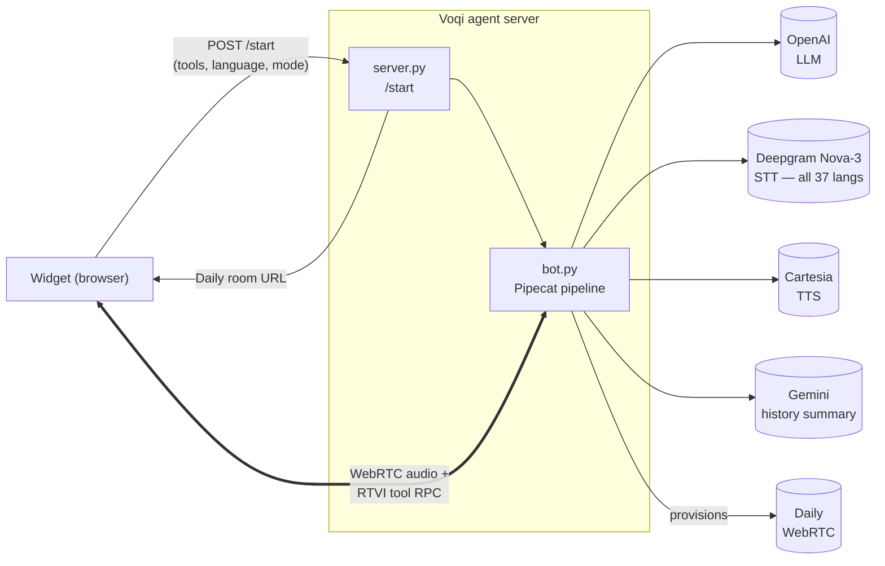

# voqi-agent-server

The Python voice agent server. Hosts a Pipecat-based pipeline (STT →
LLM with structured-output tool calls → TTS) that the Voqi widget
connects to over WebRTC.

## Run

```bash
cp .env.example .env
# fill in OPENAI_API_KEY, DAILY_API_KEY, DEEPGRAM_API_KEY,
# CARTESIA_API_KEY, GOOGLE_API_KEY

uv sync
uv run python server.py
# 🎙️  Voqi agent server ready!
#    → POST http://0.0.0.0:3002/start to begin a session
```

The server reads agent configuration (persona, special instructions,
knowledge base) from
[`voqi.config.yaml`](voqi.config.yaml) — edit that for your app.

## Endpoints

| Endpoint | What |
|---|---|
| `POST /start` | Widget hits this to start a session. Body carries the registered tools, language, and mode. Server provisions a Daily room and boots the pipeline in-process. |

## Architecture



Voice flows over WebRTC; tool calls + transcripts flow over the RTVI
data channel.

## Files

```
.
├── server.py                       FastAPI app with /start — provisions a Daily room and runs one bot pipeline in-process per session (asyncio task)
├── bot.py                          assembles the voice pipeline — wires STT → InAppAgentProcessor → TTS → transport
├── voqi.config.yaml                per-deployment config (agent persona, software KB, additional instructions, speech keywords, turn-detection toggle)
│
├── brain/                          the agent loop — LLM call, tool dispatch, state machine
│   ├── processor.py                the main FrameProcessor — priority queue, five wake modes, streaming inference, interruption, idle timer, watchdogs
│   ├── tool_dispatcher.py          tracks pending tool calls per demonstration; stale-result guards (the per-batch timeout handler in processor.py is the single source of truth for "took too long")
│   ├── screenshot_service.py       request_screenshot RTVI round-trip + multimodal-message splicing of the captured JPEG
│   ├── conversation_history.py     bounded message buffer with opportunistic Gemini summarisation when the window overflows
│   ├── agent_output.py              structured-output Pydantic schemas — per-wake gated (`tool_invocations` etc. dropped on wakes where they don't apply)
│   ├── config.py                   `InAppRuntimeConfig` + the two Jinja system-prompt templates (action mode, guide mode)
│   ├── canned_speech.py            pre-written multilingual responses for idle / session-cap / LLM-error / inference-retry-exhausted / batch-ceiling-hit states
│   └── frames.py                   custom frame types specific to the in-app loop — `RankedEnvelope`, `InAppMessageFrame`, `MessageType`
│
├── adapters/                       wrappers between the brain and the outside world (STT, TTS, turn-start, RTVI)
│   ├── languages.py                widget code → Deepgram `Language` enum + Cartesia TTS voice catalogue (drives the 37-language picker)
│   ├── cartesia_tts.py             hardened Cartesia TTS service — skip-empty-text guard + reconnect-on-error
│   ├── turn_start.py               user-turn-start strategy that drops to 1 word while the bot is mid-utterance (lets short interruptions register)
│   ├── rtvi.py                     `CustomRTVIProcessor` — RTVI data-channel processor that tags every message with `client`/`bot` origin
│   └── frames.py                   bucket for custom pipeline frames (Pipecat frames flow between processors as the communication primitive); currently holds `SessionOpenFrame`
│
├── tests/                          three-layer pytest suite — see [tests/README.md](tests/README.md)
│   ├── conftest.py                 shared fixtures (autouse env stubs + restore for processor-module constants)
│   ├── harness/                    in-process drivers (no network) — `processor_harness.py`, `fakes.py`, `llm_judge.py`
│   ├── layer1_unit/                pure functions, schemas, Jinja templates, isolatable classes (~300 tests)
│   ├── layer2_processor/           full state machine via the deterministic harness (~140 tests)
│   └── layer3_real_llm/            real OpenAI calls + LLM-judge — `rubrics.yaml` carries 49 scenarios + the two single-shot attention tests
│
├── pyproject.toml                  uv project manifest, pytest config (deselects `llm_judge` by default), ruff config
├── uv.lock                         locked dependency graph
└── .env.example                    template — copy to `.env` and fill in API keys
```

## Configuration

See [`docs/configuration.md`](../../docs/configuration.md) at the repo
root. Two files matter:

- **`voqi.config.yaml`** — agent persona, host software name + TLDR,
  knowledge base (inline `docs:` or path via `docs_file:`), additional
  instructions, speech-keyword bias, turn-detection toggle (language
  and mode are NOT here — the visitor picks both at session start)
- **`.env`** — provider API keys, optional `VOQI_ALLOWED_ORIGINS`,
  tuning knobs

## Auth

The only auth surface is an Origin allowlist. Browsers send the
`Origin` header automatically on cross-origin POSTs and respect the
CORS allow-list this server hands back, so a widget embedded on an
unlisted domain physically cannot reach `/start`. No tokens to
coordinate.

```bash
# Localhost demo — allow anything (default)
# VOQI_ALLOWED_ORIGINS unset → "*"

# Production
VOQI_ALLOWED_ORIGINS=https://app.example.com,https://staging.example.com
```

For server-to-server use (curl, integration tests), there's no Origin
header so CORS doesn't apply — anyone with network reach to the
server can hit `/start`. If you're exposing the server publicly,
front it with a reverse proxy that enforces additional auth.

## Tests

```bash
uv run pytest                # default: skips llm_judge (slow, billed)
uv run pytest -m llm_judge   # only the real-LLM scenarios
```

Three layers, in increasing fidelity — full guide at
[`tests/README.md`](tests/README.md):

1. **Layer 1 unit** (~300 tests, <1s) — Jinja templates, Pydantic
   schemas, the dispatcher, the history buffer, the screenshot service.
2. **Layer 2 processor** (~140 tests, ~5s) — full state machine via an
   offline harness that scripts the LLM with deterministic dicts.
3. **Layer 3 real-LLM** (~50 scenarios, billed) — actual OpenAI
   calls graded by a separate judge LLM. The 49 conversation
   scenarios live in
   [`tests/layer3_real_llm/rubrics.yaml`](tests/layer3_real_llm/rubrics.yaml)
   and run via one parametrised test; two additional tests cover
   screenshot reasoning and guide-mode pointing. Opt-in only.
